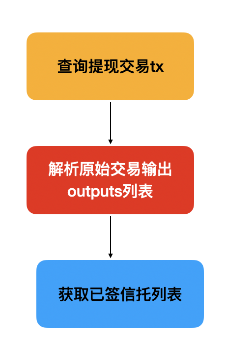

# 信托脚本

## X-BTC 充值过程

- 链上首先具备区块
- 用户转账到信托的热地址，并在交易中的 OP_RETURN 中携带用户的 ChainX 地址及其他信息，携带了信息比特币转接桥才可识别出这笔充值转账交易是与哪个 ChainX 用户相关;
- Relay 发现这笔交易，并将这笔交易提交到转接桥中；(1.0 中发现交易就可提交，直到确认才会执行，2.0 中只能提交确认过的交易)
- 当这笔交易是确认过的，执行这笔交易。当这笔交易是充值交易时，从 OP_RETURN 中解析出 ChainX 地址，发放对应的 X-BTC 金额至该 ChainX 账户。
- 至此，比特币充值流程执行完毕

## X-BTC 提现流程

- 用户申请提现 X-BTC
- ChainX 转接桥/网关模块中的记录模块会锁定对应的 X-BTC 并记录用户的申请信息，该信息有唯一的 ID 与其关联。
- 信托周期性获取当前申请中的提现，并根据提现信息组织比特币提现交易原文。
- 提现交易原文发送到 ChainX 比特币转接桥中会锁定对应的提现记录，之后其他的信托基于这个比特币原文进行比特币多签签名。
- 签名完成后比特币交易会提交到比特币网络中；
- 打包后 relay 会提交该提现交易到转接桥中，确认后会释放对应提现记录及销毁锁定的 X-BTC。
- 至此，比特币提现流程执行完毕。

## 模块

### 显示链上代签原文



#### rpc 接口

- 获取链上代签原文
  交易原文通过拿存储的方式,位于 bitcoin/src/lib#231: WithdrawalProposal

  ```js代码
  const api = await ApiPromise.create();

  // Retrieve the last block header, extracting the hash and parentHash
  const { hash, parentHash } = await api.rpc.chain.getHeader();

  console.log(`last header hash ${hash.toHex()}`);

  // the format is always `.at(<blockhash>, ...params)`
  const balance = await api.query.xgatewaybitcoin.withdrawalproposal.at(
    parentHash
  );
  ```

````

- 获取信托列表，信托相关位于ChainX common模块
rpc接口： api.rpc.xgatewaycommon.bitcoinTrusteeSessionInfo

### 提现

构造提现交易

api.xGatewayCommon.withdraw('1',0.001)

```js


```
## How to use

1. 显示当前提现列表

```js
yarn run list
````

2. 显示链上信托代签原文

```js
yarn run tx

```

3. 构造提现交易原文

如果仅需构造交易原文，不需要提交原文，执行：

```javascript
yarn run create
```

如果需要马上将所构造的交易提交到 ChainX 链上，则执行：

```javascript
yarn run create-sub
```

同时，须确保设置 `bitcoin_private_key`和`chainx_private_key`。

4. 响应待签原文

如果仅响应待签原文，暂不提交上链，执行：

```javascript
yarn run respond
```

如果需要马上将所构造的交易提交到 ChainX 链上，则执行：

```javascript
yarn run respond-sub
```
